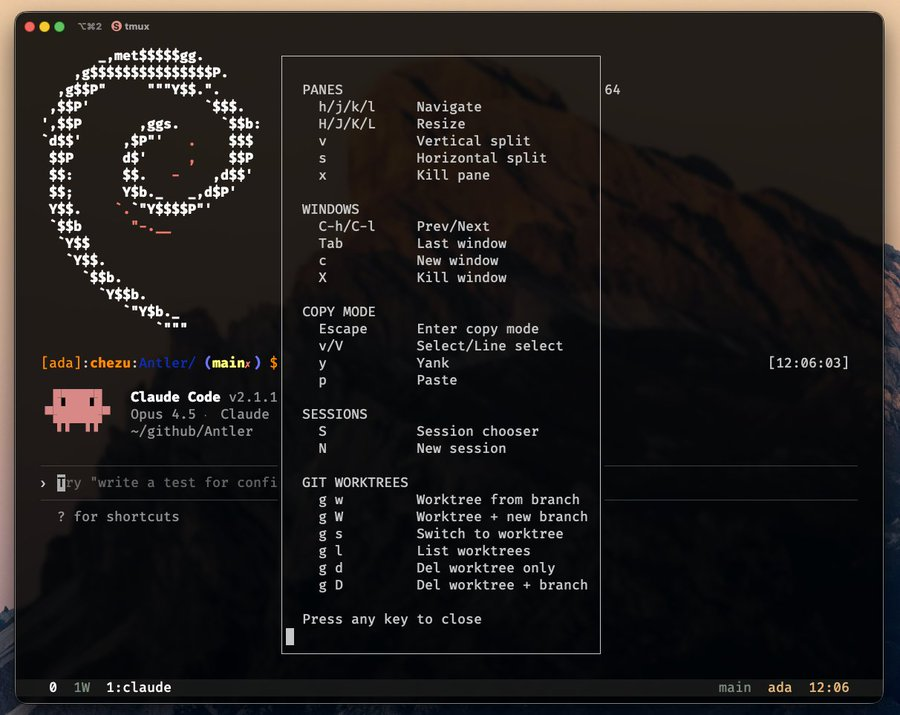

# tmux-worktree

A warm-themed tmux config with vim keybindings and git worktree integration.



## Features

- **Warm color palette** - Terracotta, Charcoal, Cream, Sage, Amber
- **Vim-style keybindings** - hjkl navigation, vim copy mode
- **Git worktree integration** - Manage worktrees with fzf selection
- **Session per worktree** - Auto-creates tmux sessions named after branches

## Requirements

- tmux
- git
- [fzf](https://github.com/junegunn/fzf)

## Installation

Install dependencies:

```bash
# Debian/Ubuntu
sudo apt install tmux git fzf

# macOS
brew install tmux git fzf
```

Clone and install:

```bash
git clone https://github.com/christophergyman/tmux-worktree.git
cd tmux-worktree
./install.sh
```

## Keybindings

All bindings use the tmux prefix (default: `Ctrl-b`).

### Panes

| Key | Action |
|-----|--------|
| `h` `j` `k` `l` | Navigate panes |
| `H` `J` `K` `L` | Resize panes |
| `v` | Vertical split |
| `s` | Horizontal split |
| `x` | Kill pane |

### Windows

| Key | Action |
|-----|--------|
| `C-h` / `C-l` | Previous / Next window |
| `Tab` | Last window |
| `c` | New window |
| `X` | Kill window |

### Copy Mode

| Key | Action |
|-----|--------|
| `Escape` | Enter copy mode |
| `v` / `V` | Select / Line select |
| `y` | Yank |
| `p` | Paste |

### Sessions

| Key | Action |
|-----|--------|
| `S` | Session chooser |
| `N` | New session |

### Git Worktrees

| Key | Action |
|-----|--------|
| `g w` | Create worktree from existing branch |
| `g W` | Create worktree with new branch |
| `g s` | Switch to worktree session |
| `g l` | List worktrees |
| `g d` | Delete worktree (keep branch) |
| `g D` | Delete worktree and branch |

Press `?` for an in-terminal cheatsheet.

## How Worktrees Work

The `g` prefix enters "git mode". Worktrees are created in `.worktrees/` at the repo root. Each worktree gets its own tmux session named after the branch, making it easy to context-switch between features.
